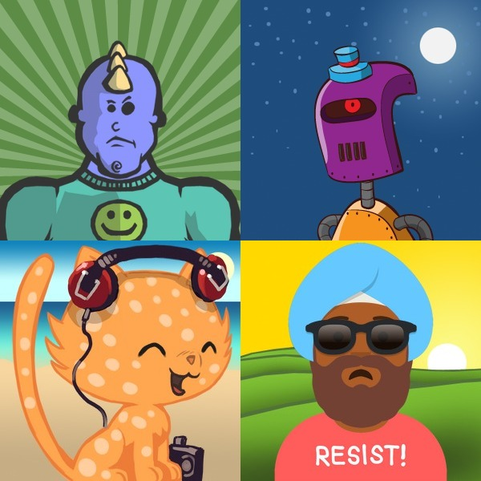

# make-avatars
Simple script to generate an avatar.

Live [demo](https://demching.github.io/make-avatars/src/)

## License
The scripts of this project is licensed under [MIT](LICENSE).

The assets used in this project are provided by [Robohash.org](https://robohash.org), licensed under [CC-BY-3.0](https://creativecommons.org/licenses/by/3.0) and [CC-BY-4.0](https://creativecommons.org/licenses/by/4.0). You may want to visit the original [repo](https://github.com/e1ven/Robohash) and check the detailed [License](https://github.com/e1ven/Robohash#license).

## Donate
If you find this repo useful, please share to your friends. Or you can buy me a coffee:

